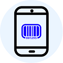

# Unity Barcode Scanner
 

**IMPORTANT: This Project is not supported anymore !!!** [Link](https://github.com/kefniark/UnityBarcodeScanner/issues/48)

Since months, I was looking for a good way to parse QRCodes (and generic barcode) in Unity.
So, I was just trying to do something simple, readable, cross-platform and open source.
* Tested with Unity `5.3.x`, `5.4.x`, `5.5.x` , `2017.3.x`
* Tested on `PC`, `Mac`, `Android`, `iOS`, `WebGL`
* Tested with the following barcode format:
  * 1D : `Code 39`, `Code 128`, `ISBN`
  * 2D : `QR Code`, `Aztec`, `Data Matrix`

# How does that work ?
This project is a Unity Project you can use directly.

Every part is separated and can be replaced or extended if needed
* Camera : use directly the API of unity to access the webcam (available on iOS, Android, Windows, Mac, Linux, ...)
* Parser : use zxing to extract the data https://zxingnet.codeplex.com/ (Apache 2)
* Scanner : use Camera & Parser and manage them in a unity context

And that's it, few C# files and a dll

# How to use it ?
* [Example](Assets/Samples/)
* [Install](Assets/)
* [Tests](Assets/Editor/)
* [Code](Assets/Scripts/)

# License
Under license WTFPL (http://www.wtfpl.net/about/)
